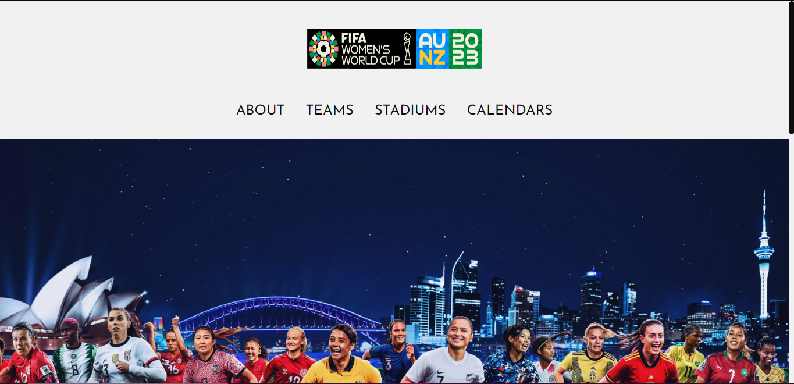

# 2023 FIFA Women's World Cup Landing Page

I developed this project hoping to explore more ways of doing things with React as well as to share a little bit about my passion for football.

This is a landing page with what I believe is the most important information regarding the 2023 FIFA Women's World Cup, such as basic information about the tournament and this edition, the countries that will be participating, the stadiums that will host the games and two calendars, the official FIFA one and the one I developed during Rocketseat's NLW.

## 🔧 Technologies Used

- HTML5
- JSX
- Javascript
- React
- Styled Components
- React Router DOM

## 🔗 Visit 

To visit the 2023 FIFA Women's World Cup just <a href="https://wwc-2023.vercel.app/" target="_blank">click here</a>!

##  📱 Demo

| Desktop Version |
|----------------|
||